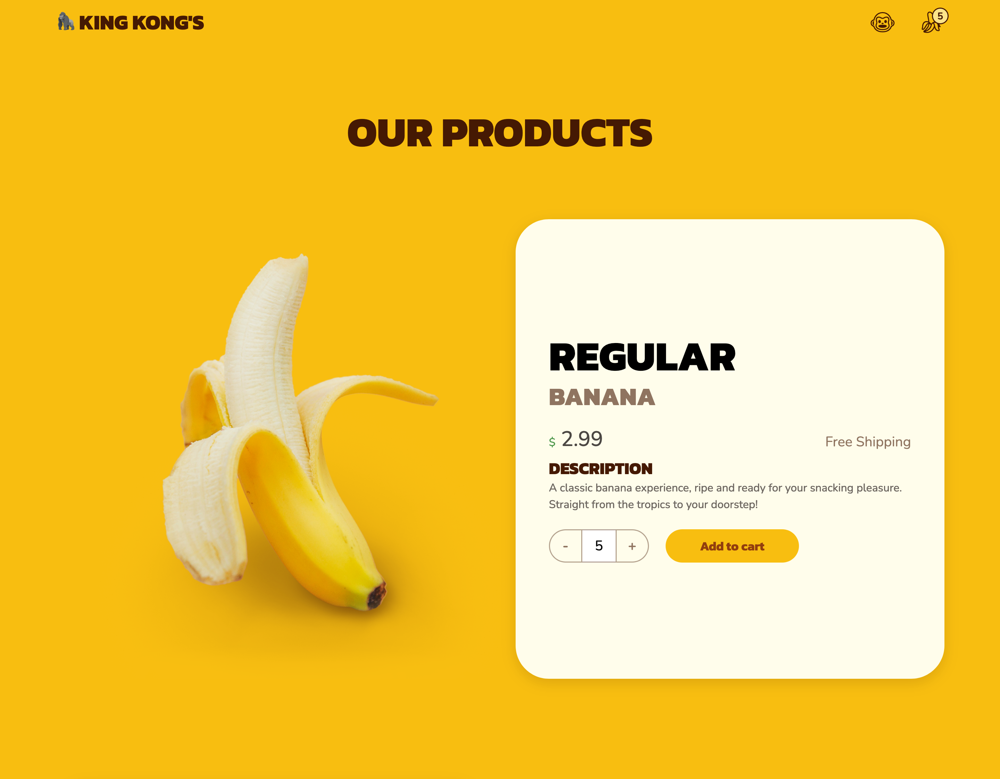

<h1 align="center">
  
  <br/>
  King Kong's Banana Kingdom
</h1>

<h4 align="center">Fullstack Banana Web Shop with Custom Login, Stripe Integration, and PostNord API</h4>
<p align="center">
  <a href="#key-features">Key Features</a> •
  <a href="#how-to-use">How To Use</a> •
  <a href="#installation">Installation</a> •
  <a href="#api-endpoints">API Endpoints</a> •
  <a href="#related">Related</a> •
  <a href="#license">License</a>
</p>

## Assignment

This project is an assignment to create a webshop where users can place orders and make payments integrated with Stripe. Users should be able to register and log in. The user will be created as a customer in Stripe, and their username/email and encrypted password will be stored in a JSON file on the server. User login will be managed using cookies. All products will be managed through Stripe.

## Key Features

- Custom login using cookie-session for user authentication.
- Integration with Stripe API for product management and payments.
- Utilization of PostNord API to provide service points for delivery.
- Backend built with Express and TypeScript.
- Client built with React and Tailwind.

### Requirements

#### G

1. [x] **Product Listing:** Implemented a page to list products.
2. [x] **Stripe Integration:** Products displayed and purchased are fetched from Stripe.
3. [x] **Shopping Cart:** Users can add products to a shopping cart.
4. [x] **Order Placement:** Users can place orders through Stripe based on the shopping cart.
5. [x] **User Registration:** Users can register as a user in the webshop. This creates a "Customer" in Stripe and saves the user data in a JSON file.
6. [x] **User Login:** Implemented user login functionality. The logged-in customer (also saved in Stripe) is used when placing an order.
7. [x] **Authentication:** Users cannot place an order without logging in.
8. [x] **Order Logging:** All placed orders are saved to a list in a JSON file.
9. [x] **Payment Validation:** Orders are not saved without completed payment.

#### VG

1. [x] **Discount Code:** Users can enter a discount code to receive a discount on their purchase (handled through Stripe).
2. [x] **Order History:** Logged-in users can see their placed orders.
3. [x] **Address Selection:** Users need to fill in their address and select a pickup location for the package before payment (PostNord API).
4. [x] **Email Confirmation:** Upon successful order, an email is sent to the customer (Resend Email API).

## How To Use

### Installation

1. Clone the repository from [GitHub](https://github.com/thejoltjoker/FSU23D-checkout-session).
2. Navigate to the project directory.
3. Follow instructions to set up [client](./client/README.md) and [server](./server/README.md).
4. Run `npm run start` in the `server` directory.
5. Open a new terminal and run `npm run dev` in the `client` directory.
6. Navigate to <http://localhost:5173> in your favorite browser to use the app.
7. Use the promo code `BANANZA` during checkout.

#### Client Setup

1. Clone the repository:

   ```bash
   git clone https://github.com/thejoltjoker/FSU23D-checkout-session.git
   cd FSU23D-checkout-session/client
   ```

2. Install dependencies:

   ```bash
   npm install
   ```

3. Start the development server with the following command:

   ```bash
   npm run dev
   ```

#### Server Setup

1. Clone the repository:

   ```bash
   git clone https://github.com/thejoltjoker/FSU23D-checkout-session.git
   cd FSU23D-checkout-session/server
   ```

2. Install dependencies:

   ```bash
   npm install
   ```

3. Create a `.env` file in the project root and add the following:

   ```env
   PORT=3000
   SESSION_SECRET=my-session-secret
   STRIPE_API_KEY=sk_test_XXXXXXXXXXXXXXXXXXXXXXXXXXXXXXXXXXXXXXXXXXXXXXXXXXXXXXXXXXXXXXXXXXXXXXXXXXXXXXXXXXXXXXXXXXXXXXXXXXX
   POSTNORD_API_KEY=xxxxxxxxxxxxxxxxxxxxxxxxxxxxxxxx
   RESEND_API_KEY=xxxxxxxxxxxxxxxxxxxxxxxxxxxxxxxx
   ```

4. Start the server with the following command:

   ```bash
   npm run start
   ```

## Related

- [FSU23D-the-restaurant](https://github.com/thejoltjoker/FSU23D-the-restaurant) - Second group assignment in the full stack course at Medieinstitutet.

### You may also like...

- [Picterest](https://github.com/thejoltjoker/picterest) - Full-stack app integrating Google Custom Search and Auth0 for user login, image search, and saving favorites. First assignment of FSU23D Integration course.
- [SnapCat](https://github.com/thejoltjoker/snapcat) - Mock Social Media for Cats, Powered by React, TypeScript, React Router, Vite, and Tailwind CSS.

## License

This project is licensed under the [MIT License](LICENSE).
